# Bootstrapping a natural-deduction prover past its training length

# THE SETTING FROM SCRATCH

## 1. What is being asked

We train a small decoder-only network on examples of *short* mathematical proofs that are never
longer than 6 steps and then use RL setting to make it produce longer
proofs than any it was trained on, and measure how much longer proofs can get.

More specifically, our target score is a single number, `L - P` where:

- **P** = the longest proof the model could reliably write *before* RL
- **L** = the longest proof it can reliably write *after* RL

## 2. Logic basics 

Here is a complete, verifier-accepted proof for a sequence and how it would look like: 

    THM ( P > Q ) , P SEQ Q PRF
    N1  ( P > Q )  :  PR ;
    N2  P          :  PR ;
    N3  Q          :  IMPE N1 N2 ;
    QED

Here`THM` marks the premises, `SEQ` marks the goal,
`PRF` indicates proof beginning. and `QED` the end. These are punctuation.

Some of the rules, such as `IMPE`, need two specific inputs: an
implication, and the thing on its left. Writing `Q : IMPE` alone would leave the
checker unable to verify anything. 

They are also the fragile part. Swapping them breaks the proof while everything
else still looks fine:

    N3 Q : IMPE N1 N2 ;   ->  accepted
    N3 Q : IMPE N2 N1 ;   ->  REJECTED: "rule check failed: IMPE (line 3)"

### 2.4 Logic rules

In total there are fifteen rules. The organising principle is, for each connective, one
rule builds it and one rule uses it.

| connective | INTRODUCTION (build it) | ELIMINATION (use it) |
|---|---|---|
| `&` and | `ANDI`: from `A` and `B`, get `( A & B )` | `ANDE1`/`ANDE2`: from `( A & B )`, get `A` or `B` |
| `v` or | `ORI1`/`ORI2`: from `A`, get `( A v X )` | `ORE`: from `( A v B )`, argue by cases |
| `>` if | `IMPI`: assume `A`, reach `B`, get `( A > B )` | `IMPE`: from `( A > B )` and `A`, get `B` |
| `~` not | `NEGI`: assume `A`, reach `F`, get `( ~ A )` | `NEGE`: from `A` and `( ~ A )`, get `F` |
| `F` | — | `BOTE`: from `F`, get **anything** |

### 2.6 Proof length and the task's goal 

The length of a proof is its number of lines, premises included. The proof
example given previously has length 3, for instance.

A proof is a chain of lines, and if the model gets each step
right with probability `p`, an `n`-step proof is right with probability roughly
`p^n`. Errors compound multiplicatively and Length is therefore a difficulty
measure that is an integer, reported by the verifier.

**Critical distinction: a theorem does not have a length; a proof does.** The
same theorem may have a 12-line proof and a 4-line one. This is not pedantry — I
generated 30,000 theorems using proofs of 9-16 lines and found that **26,941 of
them (90%) are provable in 6 lines or fewer**.

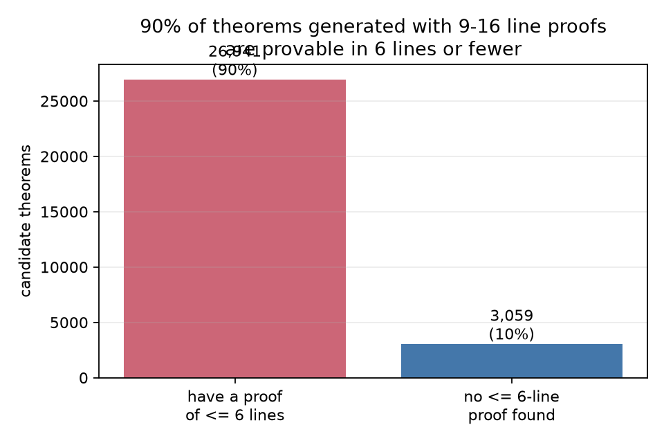

*Figure 4. Of 30,000 theorems generated with 9-16 line proofs, 90% turn out to
have a proof of 6 lines or fewer. Treating "the proof I generated it with" as
"how hard the theorem is" would have produced a large, meaningless result. The
10% that survive a search-based filter are the RL targets.*

# WHAT WE BUILT

## 3. The datasets

In total we have six datasets serving different purposes and created accordingly.

| dataset | size | where it comes from | what it is for |
|---|---|---|---|
| `train` | 116,316 | my generator, proofs 2-6 lines | supervised training |
| `heldout` | 3,000 | my generator, **disjoint theorems** | does it generalise in-distribution? |
| `rl_targets_hard` | 1,994 | my generator, 9-16 lines, filtered hard | RL practises on these |
| `transfer_hard` | 800 | same, **RL never sees these** | does RL generalise? |
| `validation_36` | 36 | **written by the task authors** | external check, textbook theorems |
| `test_short/long` | 267 + 532 | **written by the task authors** | scored once, like a leaderboard |

### 3.1 How training data is generated

Our datasets are created in a random fashion. We start from random premises, repeatedly apply a randomly chosen
*applicable* rule, and whatever the last line denotes by definition is a valid theorem.

Result: **18,396 of 18,396** generated proofs pass the verifier. Zero invalid.
About 5,400 proofs per second.

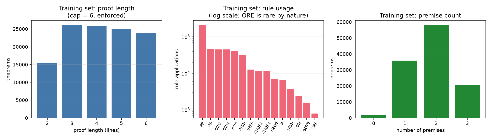

*Figure 10. What the generator actually produces. Left: proof length, roughly
flat over 2-6 with a dip at 2 (the cap is enforced -- 0 violations). Middle:
rule usage on a log scale. `PR` dominates because every proof restates its
premises; `ORE` is rarest at 792 uses because a case split needs a citable
disjunction and two branches that reach the same formula. Right: premise count,
peaking at 2.*

Rule counts: `PR` 213,320 · `AS` 46,681 · `ORI2` 45,286 · `ORI1` 45,052 ·
`IMPI` 41,362 · `ANDI` 32,202 · `IMPE` 12,641 · `ANDE2` 11,378 · `ANDE1` 11,366
· `NEGE` 6,971 · `R` 6,481 · `NEGI` 3,735 · `DN` 2,394 · `BOTE` 1,575 ·
`ORE` 792. Premise counts: 0 -> 1,963 · 1 -> 35,847 · 2 -> 58,045 · 3 -> 20,461.

We need to look out for two things:

- **Rule coverage.** The first version picked a rule and *then* checked whether
  it applied, so rarely-applicable rules starved — `ORE` appeared 35 times in
  20,000 proofs. Enumerating *applicable* rules first took `IMPE` from 227 to
  2,159 and `NEGE` from 457 to 1,512.
- **Useful premises.** Random premises rarely contain a disjunction or a
  matching implication/antecedent pair, so the walk had nothing to work with.
  About 55% of proofs now start from a structured pattern like `[(A>B), A]`.

Box rules cannot arise one step at a time (they need a box opened earlier with
exactly the right hypothesis), so they are emitted as **macros** that plan the
whole box: assume, derive, discharge.

Our splits also guaraante that:
- **Disjoint by theorem**: a sequent never appears on both sides of a split.
- **Decontaminated**: no training theorem is, or is an atom-renaming of, a
   test theorem. (An *atom-renaming* is the same structure with
  letters permuted: `(P>Q),P |- Q` versus `(R>S),R |- S`.)
- Verified by `validate_claims.py`: **0 overlap on every pair**, exact and under
  renaming.

Since generating length overstates difficulty, every RL candidate is
probed with 24 samples from a trained model and dropped if any sample produces a
proof of ≤6 lines. Survivors are labelled *"no ≤6-line proof found in 24
samples"* — an **upper bound**, not a proof of hardness. This is stated as a
limitation rather than hidden.

## 4. Token structure

Our vocabulary has **65 symbols**:

    special      <pad> <bos>                                     2
    formula      ( ) ~ & v > P Q R S F                          11
    structural   THM , SEQ PRF QED | : ;                         8
    rule names   ANDI ANDE1 ANDE2 IMPE IMPI ORI1 ORI2 ORE       15
                 NEGE NEGI BOTE DN PR AS R
    references   B1..B24                                        24
                 P1..P6                                          6

The spec numbers lines absolutely: `N5 ( R v S ) : ORI2 N1 ;`. Under a 6-line
training cap, the tokens `N7`, `N8`, ... never appear in training. At test
time on a 12-line proof, the model must emit symbols it has never been trained
to produce.

So I delete the line index (lines are `;`-delimited, so position is recoverable)
and rewrite references:

- reference to an earlier **derived** line -> `B<k>`, meaning *k lines back*
- reference to a **premise** -> `P<i>`, meaning *the i-th premise*

For example:

    spec format  : N1 ( ( S & P ) > ( P & R ) ) : PR ;
                   N2 Q : PR ;
                   N3 ( R v ( ( S & P ) > ( P & R ) ) ) : ORI2 N1 ;

    model format : ( ( S & P ) > ( P & R ) ) : PR ;
                   Q : PR ;
                   ( R v ( ( S & P ) > ( P & R ) ) ) : ORI2 P1 ;

Line 3 cites line 1, a premise, so `N1` becomes `P1`.

Premises get their own scheme because they are cited from anywhere in the proof,
so their back-distance would grow without bound (citing line 1 from line 14
would be `B13`, as unseen as `N14`). Derived lines are usually cited soon after
they are made, so back-distances stay small.

Measured on 9-16 line proofs, I report fraction of index/reference tokens
never seen in cap-6 training:

| scheme | unseen |
|---|---|
| absolute `N<i>` | **43.7%** |
| relative `B<k>` / `P<i>` | **8.1%** |

which shows around 5x reduction with relative indexing. Training only ever uses `B1`-`B4`, while
long proofs genuinely need `B5`-`B14`. This relative indexes are decoded back to spec format
before the verifier sees it.

## 5. The model

A **decoder-only transformer**  with 4 layers, width 256, 4 attention heads, which constitutes of **3.18M parameters**, trained from
scratch.

### 5.2 Positional schemes: learned, RoPE, NoPE

Attention as written is "order-blind": `Q @ K^T` does not distinguish which token came
first. Position can be injected in different ways and I experiment with three methods:

| scheme | how | weakness |
|---|---|---|
| **learned** | a second lookup table, one trainable vector per position, added to the token embedding (this is what GPT-2 does) | positions beyond the longest training sequence (194 tokens) **never receive a gradient** — they are untrained noise |
| **RoPE** (rotary) | no parameters. Before attention, rotate `Q` and `K` by an angle proportional to position. The algebra makes `Q_m · K_n` depend only on the *offset* `m - n` | none for length; a gap of 3 looks identical at position 10 or 300 |
| **NoPE** | inject nothing. A causal decoder can still infer order because position `i` attends over a strictly longer prefix than `i-1` | relies on the model to reconstruct order |

I trained all three specifically to test whether the positional scheme was the
thing limiting proof length.

### 5.3 Generation, and temperature

At inference, we feed the prompt, read the logits at the last position, choose a
token, append, repeat until `QED`.

**Choosing** the token is where temperature enters. The logits become
probabilities via `softmax(z / tau)`:

- **greedy** (`tau -> 0`): always take the most likely token. Deterministic —
  one proof per theorem, the same every time.
- **`tau = 1.0`**: sample from the model's actual probabilities. **Random** — 32
  draws give 32 different attempts.

Greedy is used for reported solve rates, because
it is reproducible; whereas we use`tau = 1.0` for RL, because expert iteration needs
diversity.

## 6. Training: targets, loss, optimiser

### 6.1 Targets

A target is the correct answer at a training position. Because the task is
next-token prediction, the target at position `i` is simply the token at
position `i+1`. Inputs and targets are the same sequence shifted by one:

    tokens : <bos> THM ( P > Q ) , P SEQ Q PRF  ...  QED
    input  : <bos> THM ( P > Q ) , P SEQ Q PRF  ...
    target :       THM ( P > Q ) , P SEQ Q PRF  ...  QED

Then the prompt is **masked**: targets inside the prompt are set to a sentinel
meaning "contribute nothing". The prompt is the *question*; we only want the
model to learn to produce the *answer*. In a 121-token example with a 46-token
prompt, 75 positions are supervised.

### 6.2 Loss

**Cross-entropy**:

    loss = -(1/N) * sum over supervised positions i of  log p(target_i | inputs so far)

Minimising this is exactly maximum likelihood, which tries to make the observed proofs as
probable as possible under the model.

### 6.3 Optimiser

**AdamW**: learning rate 3e-4, betas (0.9, 0.95), weight decay 0.1, gradient
clipping at norm 1.0, batch 256, 6,000 steps.

Schedule: 200 steps of linear warm-up (to avoid large steps while the moment
estimates are still noisy), then cosine decay to zero.

Wall clock: **278 seconds** on one H200.

## 7. Reinforcement learning

### 7.2 Expert iteration 

I use expert iteration method (or known as STaR by Zelikman et al.). 
One **round** of expert iteration is:

    for each of the ~2000 TARGET THEOREMS:
        sample k = 32 attempts at temperature 1.0     <- exploration
        run each through the verifier                  <- binary reward, 0 or 1
        keep the attempts with reward 1                <- rejection sampling
    POOL <- POOL + kept proofs
    policy <- finetune(Stage-1 weights, POOL + 20k cap-6 examples)

We implement five rounds, which takes 135 seconds each. Here, we elaborate terms in the algorithm:

**Target theorems.** The 1,994 sequents in `data/rl_targets_hard.jsonl`. They
were generated with proofs of 9-16 lines and then filtered: any candidate for
which 24 samples from a trained model found a proof of 6 lines or fewer was
discarded. 

**The pool.** Verified proofs only, accumulated across rounds. Two sources:

1. *On-target* — the attempt proved the theorem it was asked about.
2. *Hindsight-relabelled* — the attempt failed its target but is a valid proof of
   some **other** theorem. The theorem is read off the proof itself (its `PR`
   lines are the premises, its final line the conclusion), that sequent is
   verified, and the pair is added. Implemented in `nd/relabel.py`, filtered
   against every evaluation set including atom-renamings.

Attempts that are not valid proofs of anything are **discarded entirely**. The
final pool held 13,331 proofs, that is roughly 30% of
attempts survive, and the rest are thrown away.

**Finetune step** Ordinary supervised training: AdamW on cross-entropy
over the pool for 1,200 steps. Weights are updated by gradient descent
exactly as in Stage 1. The only difference from Stage 1 is *which data* it runs
on.

**Why do we restart from the Stage-1 weights every round?** If each round continued
from the previous policy, round 5's model would be five fine-tunes deep, and an
improvement could come either from better data or from accumulated drift and
over-fitting. Restarting means every round computes `train(Stage-1, pool_n)`, so
the **only** thing varying across rounds is the pool. Any change is then
attributable to data, which is what we want to measure. 

**STaR vs PPO or GRPO.** We opt for STaR, which differs from some traditional RL methods that employ policy gradient. 

In our setting, the reward enters as a filter on which data survives, not as a factor in the
gradient:

    policy gradient:    grad J = E[ r(x,y) * grad log p(y|x) ]   reward multiplies the gradient
    expert iteration:   keep {y : r(x,y) = 1}, then
                        grad L = - sum over kept of grad log p(y|x)   reward selects the dataset

Consequences of our model choice is that failures are discarded rather than pushed down, so
the method throws information away; in exchange it has no estimator variance, no
need for clipping or baselines or a value head, and the pool is reusable across
rounds because it is just supervised data. With a perfect verifier and cheap
sampling that is a good trade, which is why I opted for STaR.

### 7.3 The frozen control 

A copy of the Stage-1 model receives **exactly the same number of attempts in
every round** — k = 32 per target, every round, so after five rounds both arms
have had 160 attempts per target — and is never retrained. The only difference
between the arms is that one was fine-tuned between rounds and the other was not.

Note that sampling 32 times is itself a search. More concretely, if a model has a 3% chance
of solving some theorem in one attempt, then one attempt succeeds 3% of the time
but 32 attempts succeed `1 - 0.97^32 = 62%` of the time. That is a 3% -> 62% jump
with **no learning whatsoever**. So RL success 
could be almost entirely sampling. The frozen control measures exactly that
portion — it reached 31.2% — and then we can understand the RL contribution as the difference.

Verification that the arms are matched: at round 1 the policy **is** the frozen
model, and they solve 463 vs 440 of 1,994. Had they
diverged there, every later comparison would be meaningless.

## 8. The metric

### 8.1 Definition

Fix a sampling protocol. The **robust frontier** of a model is

    the largest n such that the model produced at least 5 DISTINCT
    verifier-accepted proofs whose written length is exactly n

Namely,

- **written**: the length of the proof the model emitted, never the length of
  the proof the theorem was generated with;
- **distinct**: different (theorem, proof-text) pairs. At `tau = 1` the model
  resamples its favourite proof constantly; one proof drawn 200 times is considered as one
  proof;
- **at least 5**: to only consider statistically significant results. Stage 1 produced
  exactly one 8-line proof in ~64,000 samples; its frontier is therefore 7.

`P` is the frontier before RL, `L` after, and the score is `L - P`.

# PART III — Results

### 9.1 Stage 1: the starting point

4 layers, 3.18M parameters, 6,000 steps, 278 seconds. Validation loss 0.081.

| metric | value |
|---|---|
| held-out greedy (n=1500) | **97.1%** [96.1-97.8] |
| by proof length 2/3/4/5/6 | 100.0 / 98.4 / 97.8 / 97.9 / **92.0**% |
| non-trivial theorems only | 96.4% |
| `validation_36` | 6/36 — bin ≤6: 6/12, bin >6: **0/24** |
| **P (robust frontier)** | **7** |

The brief's reference for a well-trained model is ≥85%, so Stage 1 is healthy.
It solves nothing at all beyond 6 lines on the external validation set.

### 9.2 What limits proof length? Three hypotheses

**Hypothesis 1 — the reference codec.** Absolute line indices `N7`+ are untrained
under a 6-line cap. **CONFIRMED, and it is the largest effect found.**

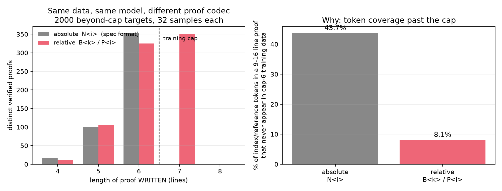

*Figure 5. Two models, identical data, identical architecture, identical seed —
only the proof codec differs. The absolute-index model (grey) writes **zero**
proofs longer than 6 lines in ~64,000 samples: its frontier is exactly the
training cap. The relative-reference model (red) writes 352 proofs past the cap.
Right panel gives the reason: absolute indices leave 43.7% of a long proof's
index tokens untrained, relative references leave 8.1%.*

Note the trap: the absolute model is **better** in-distribution (96.6% vs 96.3%
held-out). Tracking only accuracy would have said the codec was irrelevant.

**Hypothesis 2 — the positional scheme.** Learned position embeddings are
untrained past 194 tokens. **FALSIFIED.**

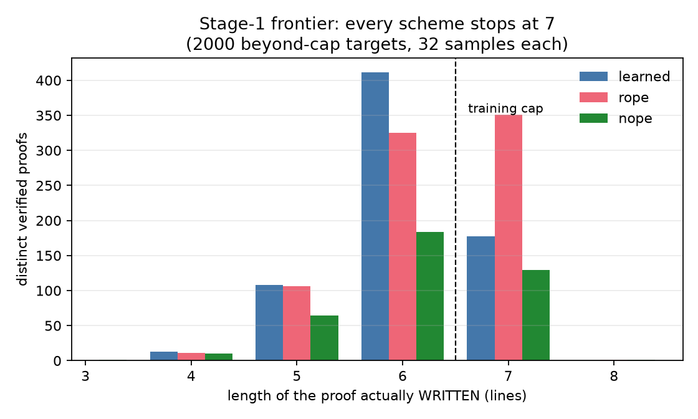

*Figure 2. `learned`, `rope` and `nope` reach the same validation loss (~0.077)
and the same held-out rate (95-96%), and **all three stop at exactly 7 written
lines**. The scheme shifts how many 7-line proofs get written (rope 351, learned
177, nope 129) but not where the wall is.*

**Hypothesis 3 — a learned stopping prior.** **SUPPORTED**, and it explains the
rest.

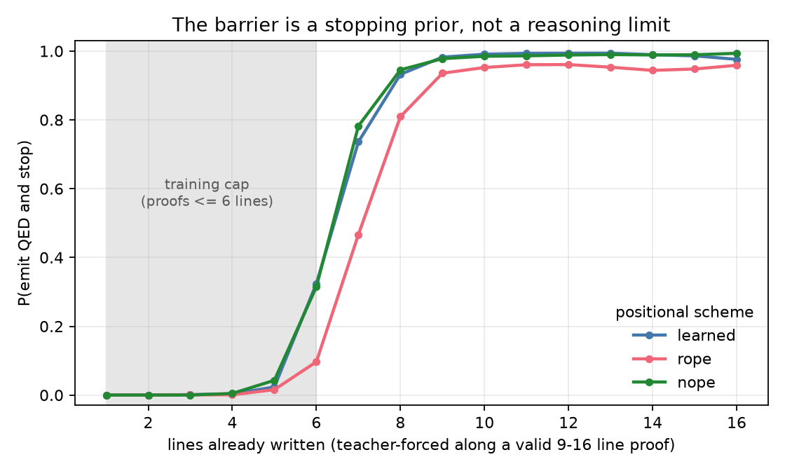

*Figure 1. Each model is teacher-forced along a **known-valid** 9-16 line proof
and asked, at each line boundary, whether to stop. Even mid-way through a proof
it is being shown is correct, Stage 1 wants to emit `QED` with probability 0.32
after line 6, 0.74 after line 7, and above 0.93 by line 9. To write a 10-line
proof by sampling it must decline to stop four times in a row — a product of
small numbers, which is why the ceiling is a hard stop rather than a gradual
decline. Note that `rope` has the weakest prior at every line, which correctly
predicted that it would write the most 7-line proofs.*

### 9.3 Expert iteration works, and the control proves it

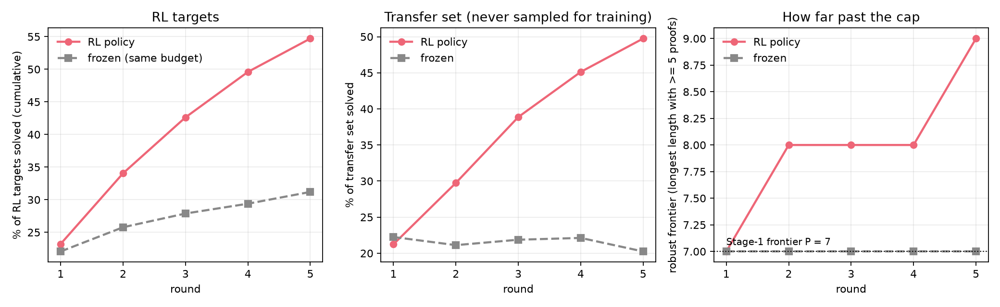

*Figure 3. Five rounds. Left: cumulative fraction of RL targets solved — the
policy climbs to 54.7% while the frozen control, given exactly the same number
of attempts, reaches 31.2%. Middle: the transfer set, which RL never samples,
goes from 21% to 49.8% while the control stays flat near 21% — so this is
generalisation, not memorisation of the targets. Right: the robust frontier
steps 7 -> 8 -> 9 while the control never leaves 7.*

Two independent seeds:

| | seed 0 | seed 1 | frozen |
|---|---|---|---|
| RL targets solved | 54.7% | 53.2% | 31.2% / 30.2% |
| transfer set | 49.8% | 48.4% | 20.2% / 21.6% |
| held-out (in-distribution) | 96.8% | 96.4% | (Stage 1: 97.1%) |
| **robust frontier** | **9** | **10** | **7** |
| distinct 8-line proofs | 547 | 611 | **1 / 0** |
| distinct 9-line proofs | 32 | 106 | 0 |
| distinct 10-line proofs | 1 | 10 | 0 |

**L = 9-10, P = 7, so `L - P` = 2-3.** The conservative claim both seeds support
is **`L - P` ≥ 2**. The frozen control produced a *single* 8-line proof across
five rounds and no 9-line proofs at all.

### 9.4 Why: RL flattens the stopping prior

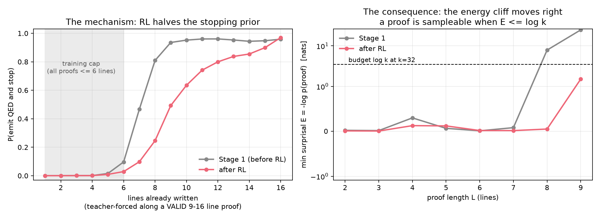

*Figure 7. Left: RL roughly halves the stopping probability at every line — at
line 9 it falls from 0.94 to 0.49. Right: the consequence in energy terms. The
minimum surprisal of the cheapest verified L-line proof is flat and then
**cliffs**; RL moves that cliff from between 7 and 8 to past 9. A proof is
sampleable when its surprisal falls below the budget `log k` (dashed line).*

This is the causal chain, and each link is measured.

**Step 1 — the capability is latent, not absent.** "Latent" means: the model
already assigns *nonzero probability* to a correct long proof, it just almost
never emits one. Measured, for Stage 1 the cheapest verified 8-line proof has
probability about 4 in 10,000. That is small, but it is not zero, and it is
nonzero for a concrete reason — the model learned *local* structure (which rules
apply to which formulas, how boxes open and close), and a long proof is a
composition of local steps.

**Step 2 — sampling is search.** 32 draws at temperature 1.0 explore 32 different
continuations. A 1-in-10,000 event is still rare in 32 draws, but across 2,000
targets it happens somewhere.

**Step 3 — the verifier separates signal from noise, for free.** Of 32 attempts,
most are wrong. **Those are discarded** — expert iteration never trains on them
(§7.2). The point of this step is not that failures are informative; it is that
*correct* attempts can be identified with certainty and no human effort. The
verifier is a binary oracle: 1 if the proof is accepted for the prompted
sequent, 0 otherwise, with no partial credit. Checking is linear time; finding is
the hard direction. That asymmetry — the **generator-verifier gap** — is what
makes a free, exact training label available for something genuinely hard.

**Step 4 — the gradient moves one specific quantity.** Fine-tuning on an accepted
7-line proof raises its probability. That training example contains a *decision
to continue* at line 6, so the gradient directly lowers `P(QED | 6 lines
written)`. This is not an interpretation; it is trackable, and §9.4.1 tracks it.

**Step 5 — the bootstrap.** A model fluent at 7 lines has non-trivial probability
at 8. Sample, verify, retrain. Round n's output is round n+1's training data.

### 9.4.1 The mechanism, tracked round by round

If step 4 is the mechanism, then `P(QED | n lines)` should fall monotonically
across rounds. Teacher-forcing each round's checkpoint along known-valid 9-16
line proofs (`scripts_qed_across_rounds.py`):

| checkpoint | L=6 | L=7 | L=8 | **L=9** | L=10 | L=11 | L=12 |
|---|---|---|---|---|---|---|---|
| SFT (round 0) | 0.123 | 0.518 | 0.865 | **0.965** | 0.972 | 0.975 | 0.974 |
| after round 1 | 0.044 | 0.186 | 0.484 | **0.773** | 0.911 | 0.963 | 0.979 |
| after round 2 | 0.030 | 0.113 | 0.336 | **0.642** | 0.835 | 0.918 | 0.952 |
| after round 3 | 0.032 | 0.095 | 0.244 | **0.494** | 0.690 | 0.805 | 0.888 |
| after round 4 | 0.028 | 0.076 | 0.169 | **0.366** | 0.510 | 0.627 | 0.747 |

Monotone at every length and every round. At line 9 the stopping probability
falls from 0.965 to 0.366. (`final.pt` equals `policy_r4.pt`: round 5 samples and
evaluates but is not followed by a retrain, so the last weight update is round
4's.)

### 9.4.2 The oracle control: would supervised learning have done this anyway?

The obvious objection: *if you simply trained on long proofs you would also get
long proofs, so what does RL add?* The answer turns on **where the data comes
from** — there is no external supply of proofs past the cap, and manufacturing
that supply is precisely what RL does. But the objection deserves a measurement,
not an argument.

So: hand a model the generator's own 9-16 line proofs for the RL targets — gold
data RL never had, and data the exam rules forbid for Stage 1 — and measure the
frontier on the transfer set, which no arm ever trains on
(`ablation_oracle_sft.py`). This is an **analysis control, not a submitted
model**.

| model | trained on | greedy | pass@32 | **robust frontier** |
|---|---|---|---|---|
| Stage 1 | cap-6 only | 5.9% | 21.9% | **7** |
| after RL | cap-6 + ~13k **self-found** proofs | 25.8% | 49.6% | **9-10** |
| **oracle SFT** | cap-6 + 1,994 **gold** long proofs | 23.2% | **63.0%** | **16** |

Oracle written lengths run to 17:
`{7:333, 8:428, 9:357, 10:166, 11:140, 12:63, 13:57, 14:26, 15:8, 16:7, 17:2}`.

**Three things follow, and the first is uncomfortable for the headline.**

1. **The objection is correct: gold data is far better than RL.** Frontier 16
   versus 9-10. RL recovered roughly a quarter to a third of the gap between the
   Stage-1 baseline (7) and what supervision on real long proofs achieves (16).
   The bottleneck in this setting is *data*, and expert iteration is an
   inefficient way to manufacture it.
2. **But that data does not exist.** The exam caps supervised training at 6 lines
   precisely to remove it, and outside a synthetic setting there is no oracle
   handing you longer proofs. RL's contribution is not that it beats gold data;
   it is that it produces *some* of the same effect **from nothing but the model
   and a checker**.
3. **The mechanism is identical in both arms**, which is the strongest evidence
   that the diagnosis is right:

| model | P(stop) after 9 lines | robust frontier |
|---|---|---|
| Stage 1 (cap-6 data) | **0.965** | 7 |
| after RL (self-found 6-8 line proofs) | **0.366** | 9-10 |
| oracle SFT (gold 9-16 line proofs) | **0.109** | 16 |

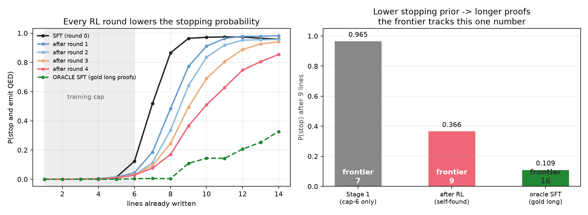

*Figure 9. Left: every RL round lowers the stopping probability at every length;
the oracle model trained on gold long proofs (dashed) sits far below all of
them. Right: the frontier tracks this single number monotonically across three
very different training regimes.*

The frontier is a monotone function of one scalar — the probability of stopping —
and that scalar is **set by the length distribution of the training data**. RL
changes it by manufacturing longer training examples; gold data changes it more
because the examples are longer still. Nothing else about the three models
differs in kind.

### 9.5 And none of it transfers

| | held-out | transfer (greedy) | transfer (32 samples) | validation_36 | val bin >6 | test_short | test_long |
|---|---|---|---|---|---|---|---|
| Stage 1 | 97.1% | **5.9%** | 21.9% | 6/36 | 0/24 | 47.6% | 8.8% |
| after RL | 96.3% | **25.8%** | 49.6% | 4/36 | 0/24 | 46.4% | 8.1% |

A 4.4x gain on the transfer set — theorems from my generator that RL never
sampled — and **nothing at all** on the two external benchmarks.

**Transfer set broken down by length**, with the frozen-model control:

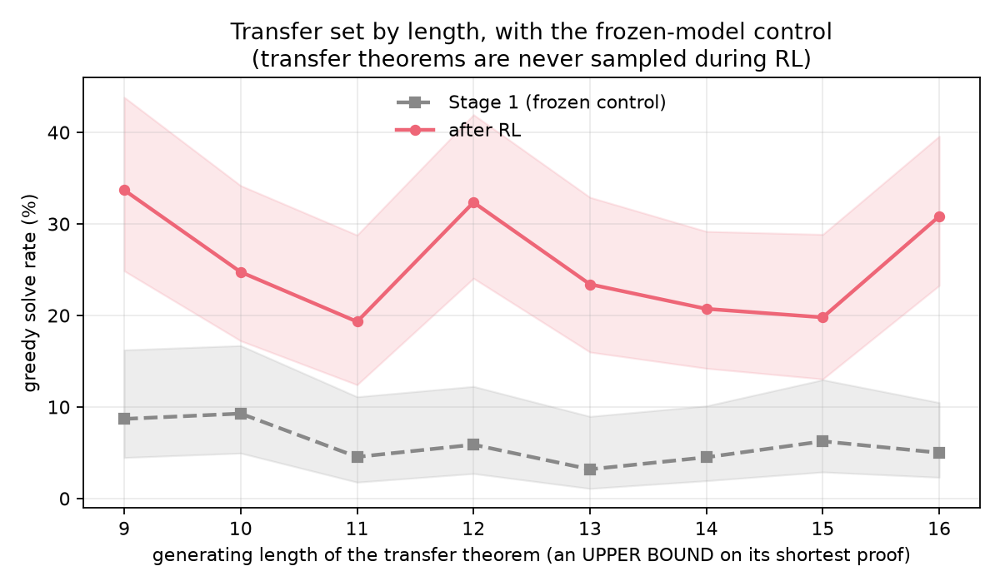

*Figure 11. Greedy solve rate on the transfer set against the generating length
of each theorem, with Wilson intervals. RL (red) is above the frozen control
(grey) at every length, and the gap does not close as theorems get longer. The
x-axis is the length of the proof the theorem was **generated** with, which is
an upper bound on its shortest proof, not its difficulty -- so the flatness of
both curves is expected and is itself evidence that generating length is a weak
difficulty signal.*

| generating length | Stage 1 (frozen) | after RL |
|---|---|---|
| 9 | 8/92 = 8.7% | **31/92 = 33.7%** |
| 10 | 9/97 = 9.3% | **24/97 = 24.7%** |
| 11 | 4/88 = 4.5% | **17/88 = 19.3%** |
| 12 | 6/102 = 5.9% | **33/102 = 32.4%** |
| 13 | 3/94 = 3.2% | **22/94 = 23.4%** |
| 14 | 5/111 = 4.5% | **23/111 = 20.7%** |
| 15 | 6/96 = 6.2% | **19/96 = 19.8%** |
| 16 | 6/120 = 5.0% | **37/120 = 30.8%** |

**Found-proof-length histogram across rounds:**

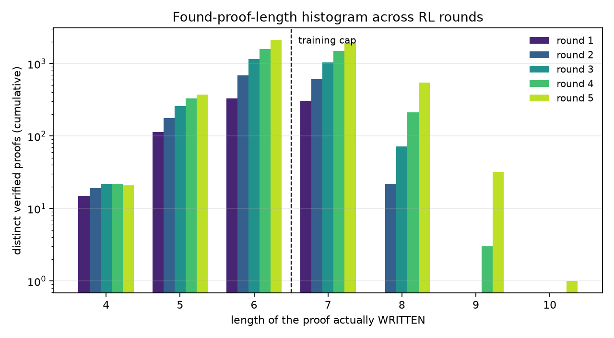

*Figure 12. Distinct verified proofs by written length, cumulative, one series
per RL round (log scale). Mass builds first at 7, then 8, then 9 -- each round
makes the next length reachable, which is the bootstrap made visible. The frozen
control's equivalent histogram after five rounds stops at 8 with a single
proof.*

The diagnosis is in the failure types. Classifying every greedy failure:

| failure class | validation_36, Stage 1 | validation_36, after RL | transfer, after RL |
|---|---|---|---|
| **invalid rule application** | **90.0%** | **78.1%** | **85.2%** |
| valid steps, missed the goal | 3.3% | 12.5% | 11.1% |
| malformed output | 3.3% | 6.2% | 3.2% |

The binding constraint is **per-line rule-application accuracy on unfamiliar
formulas** — the model writes a line that is not a valid rule application at
all, usually by citing the wrong earlier lines. RL improved the rate of complete
valid proofs on its own distribution and did not improve per-line validity on
textbook formulas.

### 9.6 Why 9 and not 30: the surprisal budget

Per-token log-probabilities add, so with `E(y) = -log p(y | prompt)`:

    p(y) = exp(-E(y)) / Z          and at temperature tau,  p_tau(y) ~ exp(-E(y)/tau)

This is the Boltzmann distribution — an exact correspondence, not an analogy.
Sampling `k` times finds a proof when `k * p(y)` is around 1, i.e.

    E(y)  <=  log k          "the surprisal budget"

Measuring the cheapest verified proof at each length:

| L | Stage-1 `E_min` | samples needed | after-RL `E_min` | samples needed |
|---|---|---|---|---|
| 2-7 | 0.01-0.30 | ~1 | 0.01-0.13 | ~1 |
| **8** | **7.86** | **2,590** | **0.05** | 1.05 |
| **9** | **24.81** | **5.9 x 10^10** | **1.51** | 4.5 |

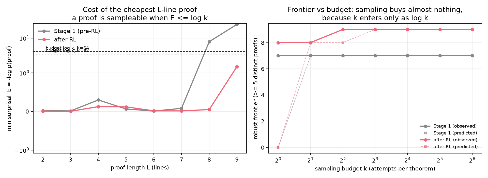

*Figure 6. Left: the minimum surprisal of an L-line proof is flat, then cliffs.
Right: the frontier as a function of sampling budget, predicted versus observed.
Predictions from `E_min(L) <= log k` match the measured frontier in **11 of 12**
testable cases across a 64x sweep.*

Three consequences, and they answer "why 9 and not 30":

1. **Sampling is exponentially weak.** `k` enters only as `log k`. Lifting Stage
   1 from 7 to 8 lines by sampling alone would need ~2,590 samples instead of 1.
   This is exactly why the frozen control's frontier never moves.
2. **Training is exponentially strong.** It moves `E` directly, and `E` sits in
   an exponent. RL cut `E_min(8)` by 7.8 units of log-probability — a factor of ~2,400 in
   probability — at the *same* budget.
3. **Each further line costs another cliff.** The frontier advances roughly one
   line per few rounds because each round must pay down a new energy barrier.
   Reaching 30 would require many more rounds, or a method that attacks the
   stopping prior directly rather than through sampling.

### 9.7 Why some theorems are easier: the entropy term

A theorem is proved if **any** of its proofs is sampled, so the governing
quantity is the free energy of the whole proof set:

    p(prove x) = sum over all proofs y of x of exp(-E(y)) = exp(-F(x))
    F(x)  ~  E  -  log g          where g = number of distinct proofs

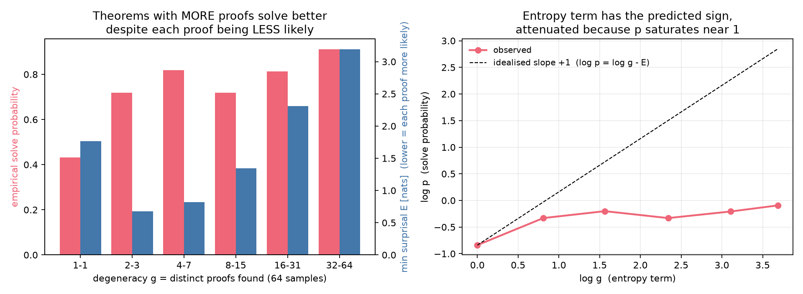

*Figure 8. Theorems with only one findable proof have the **best** energy (1.76
— that single proof is individually very likely) and the **worst** solve rate
(0.43). Theorems with 32-64 distinct proofs have nearly twice the energy — each
proof individually less likely — and solve at 0.91. Many mediocre proofs beat one
good proof, the same reason a macrostate with many microstates dominates a
partition function. Fitted slopes have the predicted signs (+0.40 and -0.54
against idealised +1 and -1); the attenuation is because the relation is a
small-probability linearisation and most solved theorems sit near p = 0.9.*

This is also how the *training distribution* enters. Degenerate theorems (23.1%
of mine: 16.5% have the conclusion as a premise, 13.2% have ≤2-line proofs) have
enormous `g` — insert a reiteration, swap `ANDI` argument order, add a vacuous
`ORI`. They concentrate probability mass at short lengths and contribute nothing
at long ones, which is a concrete mechanism by which the degenerate fraction
shapes the stopping prior. **This specific prediction is untested**; confirming
it requires retraining on non-trivial data and re-measuring.

## 10. What emergence means here

"Capability emergence" sounds like something appearing from nothing. It is not.

    frontier L*(k)  =  max { L : E_min(L) <= log k }

`E_min` is a **continuous** quantity that moves smoothly as training proceeds.
`L*` is an **integer maximum over a threshold**. So smooth improvement produces a
metric that jumps. The apparent discontinuity is an artefact of thresholding, not
a phase transition.

**When it can happen:** when the capability is already latent at nonzero
probability, when a cheap exact verifier can identify rare successes, and when
training on those successes moves probability mass toward more of them.
Bootstrapping requires all three.

**When it cannot:** if `p(correct long proof)` is *actually* zero — if the model
cannot compose the required steps at all — then no amount of sampling finds a
success, the pool stays empty, and nothing bootstraps. This is why a strong
Stage 1 matters: it supplies the nonzero seed probability.

**What is not claimed:** phase transitions, critical exponents, and random-matrix
spectra do not apply here. Those need a thermodynamic limit, an order parameter,
and a diverging correlation length. Proof length is of order 10; there is no
lattice and no criticality. The Boltzmann form and free-energy decomposition are
exact; the critical-phenomena vocabulary is not, and is deliberately avoided.

## 11. Limitations

- **The gain is 2-3 lines, inside my own distribution only.** External
  benchmarks do not move.
- **`L - P` is a length metric.** RL bought the ability to chain more steps on
  familiar theorem shapes; it did not improve per-line rule accuracy on
  unfamiliar ones, which is what `validation_36` requires.
- **The hard pool is filtered, not proved hard.** "No ≤6-line proof found in 24
  samples" is an upper bound, in the same sense as the repo's own
  `min_lines_ub`. Re-probing with three models at k=32 still found 532 short
  proofs on the "hard" pool.
- **The filter uses the model as its own prover**, so the surviving pool is
  biased toward what this model family finds hard.
- **The frontier depends on the sampling protocol.** L = 9-10 is at 32 samples,
  `tau = 1.0`; greedy gives 8. `P` is measured identically, so `L - P` is
  apples-to-apples, but neither is a single-shot number.
- **`E_min` is measured over proofs the model actually produced**, so it is an
  upper bound on the true minimum over all valid proofs of that length.
- **Two seeds, one method.** No PPO/GRPO comparison, no inference-time search.
- **Contamination was found and fixed.** The original Stage-1 training set
  contained 4 validation and 45 test theorems exactly (34.1% of test_short under
  atom-renaming). Retraining on decontaminated data changed the validation score
  not at all — the model solves the identical six theorems — and moved
  test_short by +0.8pp. Overlap turned out not to be memorisation, but the fix
  was necessary regardless.

## 12. What I would do next

1. **Attack the stopping prior directly** rather than through RL: condition on a
   target length, penalise early `QED` at sampling time, or reweight the training
   length distribution. If the diagnosis is right these should move the frontier
   far more per unit compute than more rounds.
2. **Add search**, since per-line validity on unfamiliar formulas is the binding
   constraint on `validation_36`. Best-first or MCTS over the model's own step
   proposals, with the verifier as the expansion check.
3. **Backward goal-directed generation**, so training theorems look more like
   textbook sequents than random-walk products. The transfer failure is
   plausibly a data-distribution problem as much as an algorithm problem.
4. **A bounded search prover**, so "needs more than 6 lines" becomes a proof
   rather than an upper bound.
5. **Test the degeneracy prediction** in §9.7 by retraining on non-trivial data.

---

## Appendix: where every number comes from

| artefact | contents |
|---|---|
| `numbers.md` | every number in this report, tagged by which pipeline produced it |
| `log.md` | dated log in order, including dead ends and seven corrections |
| `PRIMER.md` | the same technical material at greater depth |
| `validate_claims.py` | 25 structural checks: cap respected, all proofs verify, splits disjoint, tokenizer round-trip exact, `prove.py` interface conformant, frozen control equal-budget |
| `figures/PROVENANCE.md` | which pipeline each figure came from |
| `runs/clean_seed0/`, `runs/clean_seed1/` | per-round RL logs and checkpoints |

## AI Acknowledgment: 
- Almost all of the code produced thanks to Opus 5. The draft and figures of this report are created with Opus 5 but undergone a heavy editing by me. My part was to direct and test claims made by Opus, give experiment ideas,
- test claims, and overall supervise if claims are tested and verifiable.
